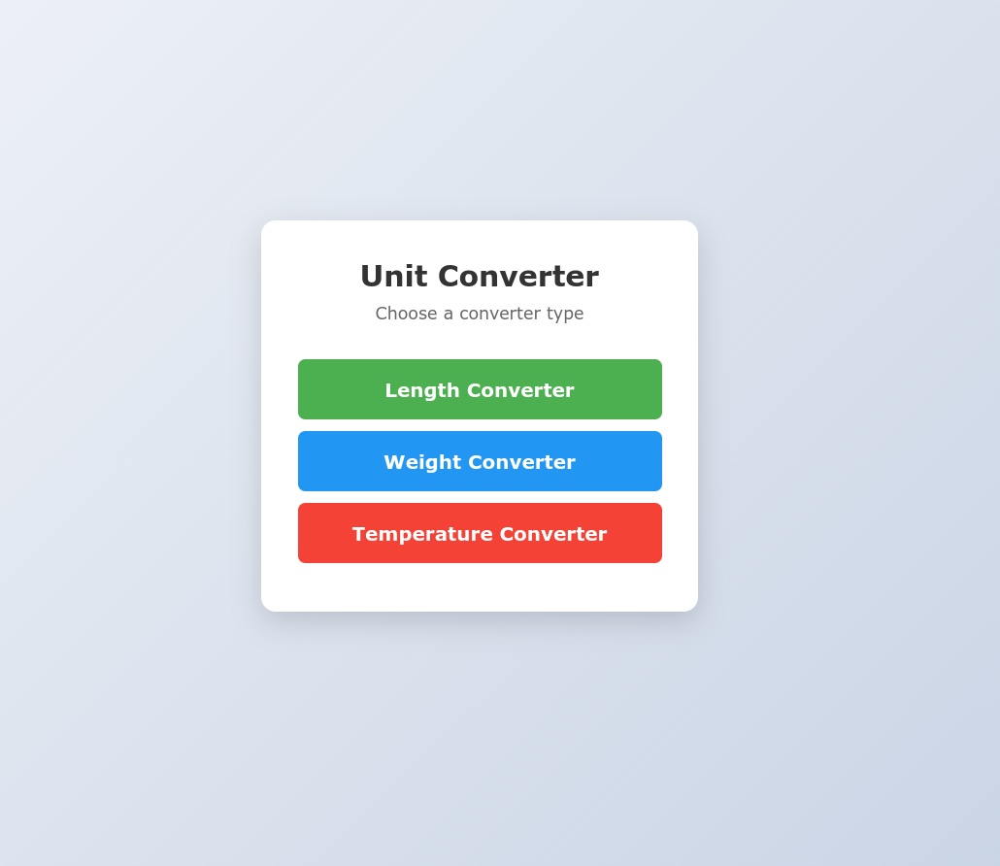
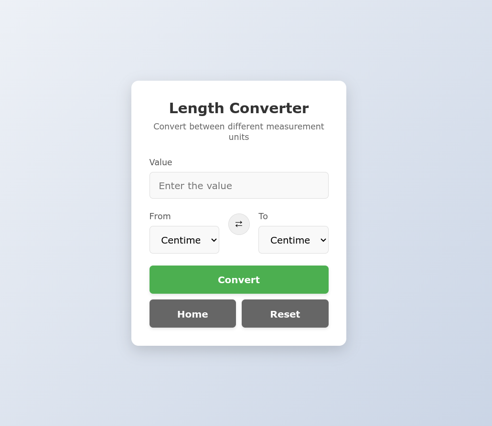
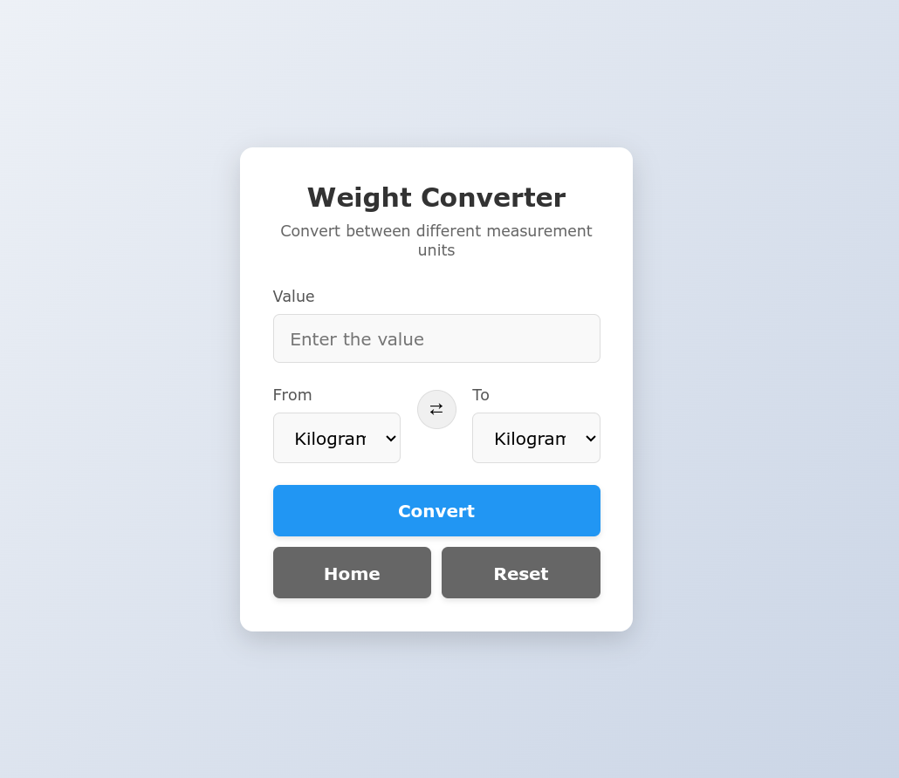
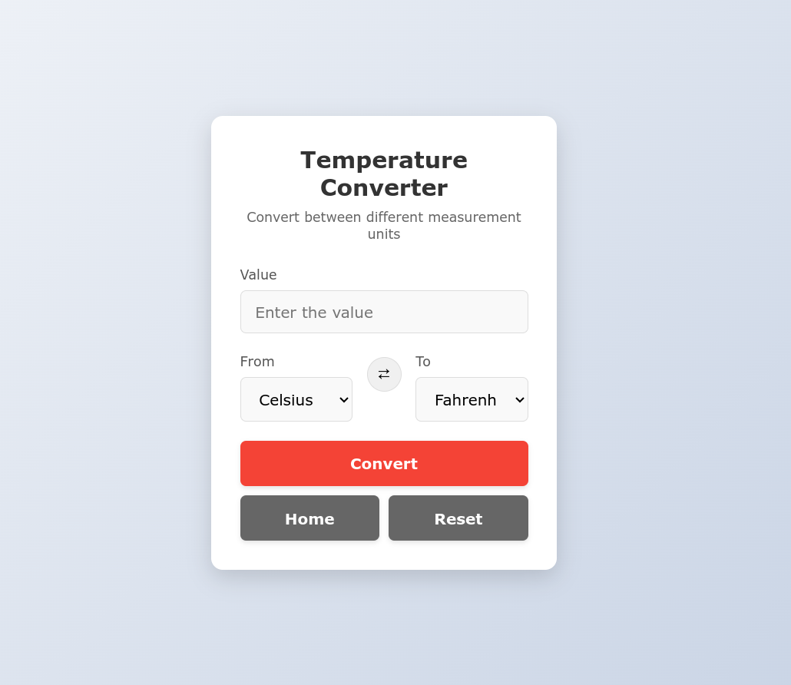

# Unit Converter

A simple web application built with Flask that allows users to convert between different units of measurement including length, weight, and temperature.

## Features

- Convert between different units of measurement:
  - Length (cm, m, km, inch, ft, mi)
  - Weight (kg, g, mg, lb, oz)
  - Temperature (Celsius, Fahrenheit, Kelvin)
- Clean and responsive user interface
- Real-time unit swapping
- Form validation and error handling
- Mobile-friendly design

## Technologies Used

- Python 3.x
- Flask
- HTML5
- CSS3
- JavaScript

## Installation

1. Clone the repository:
```bash
git clone https://github.com/Trishan0/backend-beginner-projects.git
cd backend-beginner-projects/unit-converter/flask
```

2. Create a virtual environment and activate it:
```bash
python -m venv venv
source venv/bin/activate  # On Windows: venv\Scripts\activate
```

3. Install the required packages:
```bash
pip install flask
```

4. Run the application:
```bash
flask run
```

5. Open your browser and navigate to `http://localhost:5000`

## Usage

1. Select the type of conversion (Length, Weight, or Temperature)
2. Enter the value you want to convert
3. Select the units to convert from and to
4. Click "Convert" to see the result
5. Use "Reset" to clear the form
6. Use "Home" to return to the main menu

## Project Structure

```
unit-converter/
├── static/
│   ├── style.css
│   └── home_style.css
├── templates/
│   ├── layout.html
│   ├── home.html
│   ├── length.html
│   ├── weight.html
│   └── temperature.html
└── app.py
```

## Screenshots

<div align="center">
  <div style="display: flex; justify-content: center; gap: 20px; margin-bottom: 20px;">
    <div>
      <h3>Home Page</h3>
      
    </div>
    <div>
      <h3>Length Converter</h3>
      
    </div>
  </div>
  
  <div style="display: flex; justify-content: center; gap: 20px;">
    <div>
      <h3>Weight Converter</h3>
      
    </div>
    <div>
      <h3>Temperature Converter</h3>
      
    </div>
  </div>
</div>

<div align="center">
  <p><i>Unit Converter - A simple and elegant way to convert between different units of measurement</i></p>
</div>

## Contributing

Feel free to submit issues and enhancement requests.

## License

This project is licensed under the MIT License - see the [LICENSE](LICENSE) file for details.

---

Original Project Link: [Unit Converter Project on Roadmap.sh](https://roadmap.sh/projects/unit-converter)
